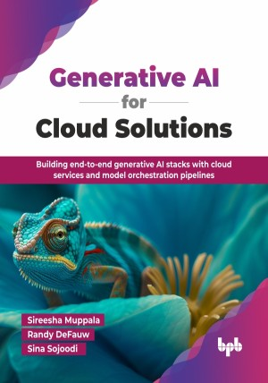

# Generative AI for Cloud Solutions

Building end-to-end generative AI stacks with cloud services and model orchestration pipelines.

This is the repository for [Generative AI for Cloud Solutions
](https://bpbonline.com/products/generative-ai-for-cloud-solutions?variant=44533342601416),published by BPB Publications.

## About the Book
Generative AI is transforming every industry, with applications ranging from creative content generation, simple chatbots, to entirely new ways of engaging with consumers. But there is as much uncertainty as buzz—understanding how to use this technology securely and responsibly, and recognizing what the pitfalls are.

In this book, we will put together a complete picture of generative AI development on modern cloud platforms, covering all stages of building and operating a production-grade solution with consideration for performance, security, governance, and responsibility. Conceptual discussions will be accompanied by functional examples, using working code on Amazon Web Services (AWS) cloud to demonstrate key concepts. We will explore the full lifecycle, from initial model selection and fine-tuning to production deployment, monitoring, and ongoing operation. Key aspects include prompt engineering, data integration techniques, observability, the shared responsibility model, and the full solution lifecycle from design to operation. Additionally, we will discuss recommendations for prioritizing a generative AI roadmap for organizations and emerging trends in the field.

As readers progress, they will gain insights into the future trends of AI and witness its transformative impact across various industries through case studies. By the end of the book, the readers will have a solid understanding of the features of foundational models and their collaboration with cloud computing, enabling them to create innovative, efficient, and ethical AI solutions in diverse cloud-based applications.

## What You Will Learn
• Basics of cloud computing and evolution of generative AI.

• Complete solution stack for generative AI to address security and performance concerns.

• Prompt engineering for improving performance and security concerns.

• Framework for the responsible use of AI to judge risks and put safeguards in place.

• Advanced fine-tuning smaller models to get effective performance at lower costs.

• Integration with data and tools to expand the power of generative AI and handle complex workflows and access new information.
